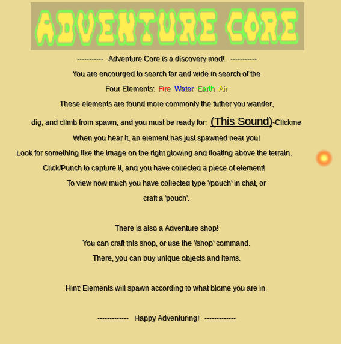

# adventure_core WIP
A Minetest Core Adventure Mod 

Explainations are better left for the mod:



## Elements

- 4 Elements, each are a floating entity in game world, and are clicked on by players
- These spawn as player walks throughout world. More spawn farther from spawn. 
- They spawn by biome in default. Otherwise, they spawn anywhere.
- They also make sound, this is how you normally find them. They produce a small amount of light. 

## Shop

Either a chat command (/shop) and/or a craftable block (all set via settings)

Players "spend" elements to purchase adventure items/nodes. These are ideally things only obtainable through the adventure shop.


## Starting Items
All players can (via a setting) start with the guidebook, and pouch. One explains the system, the other displays the current total number of elements a player has.


## Pouch and Guidebook


#### If default (minetest game) is present:

- the player crafts the adventure_shop via normal crafting. This can also be disabled via setting, and a server owner can decide where to place the shop(s) via creative mode. 
- the player can also craft the adventure_guidebook, and adventure_pouch. 

### if default is *not* present:

The player can do a command to bring up the formspec for both pouch and guidebook:
/guidebook
/pouch

In this mode, the shop can be crafted (if enabled) with the /make_shop command, which requires 10 of each element to create. 

## Built-in Nodes

*Adventure core* ships with some built-in nodes a player can create in the shop, as well as a (if enabled) craftable *shop node*.

Built-in ones, 6 static mesh nodes:
1. A small bridge
2. Bozai Tree
3. Rune thing from adventure_pack
4. Bonfire
5. Castle Flag
6. Axe Stump

------

## Integrating with adventure core

To register your nodes and items with the adventure core shop, merely *depend* on adventure_core in your depends.txt, and use the following function to register:
```
adv_core.register_object(object_name, lfire, lwater, learth, lair)
```
Where object name would be: "default:apple" etc. and lfire,lwater... are the element costs. 

There are other functions that expose the element system so you can use it for your own rewards system:
```
adv_core.spawn_element(element_type, pos) --Element_type can be: "fire" "water" "earth" "air"

adv_core.reward_player(name, fire, water, earth, air, notify) --notify is 'true' or 'false', and will tell the player when the action occurs

adv_core.take_from_player(name, fire, water, earth, air, notify)

adv_core.player_can_afford(name, fire, water, earth, air) --returns true if they can

adv_core.player_can_afford_object(name, object_name) --returns true if they can

